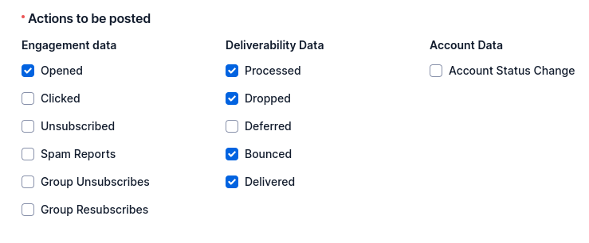

# LLM Based Custom Email Sender with Real Time Analytics

## Overview
This project is a custom email sender application that leverages Large Language Models (LLMs) to generate personalized email content. It also includes real-time analytics to track the status of sent emails.

## Features
- **Custom Email Generation**: Generate personalized email content using LLMs.
- **Real-Time Analytics**: Track the status of sent emails in real-time.
- **Scheduling**: Schedule emails to be sent at a specific time.
- **Throttling**: Control the rate at which emails are sent to avoid spamming.
- **Open Tracking**: Check whether the email has been opened straight from the dashboard.

## Usage
1. **Clone the repository**:
```bash
   git clone https://github.com/ShreyaSev/Custom-Email-Sender.git
   cd Custom-Email-Sender
```

2. **Install dependencies**:
```bash
    pip install -r requirements.txt
```

3.**Setup MongoDB**:
Ensure you have MongoDB installed and running on port 27017. To connect to a different port, change the mongodb connection url in the EmailAnalyicsTab.py file.

4.**Setup NGrok**:
Download NGrok using 
```bash 
    sudo snap install ngrok
```

Open a terminal and run 
```bash
    ngrok http 5000
```
to start a session. 

NGrok will generate a url endpoint, ending in ngrok-free.app. Note down this url. It will be used in the next step.


5.**Setup SendGrid ESP**:

 - Visit [the SendGrid website](https://sendgrid.com/en-us) and follow the steps to create an account. Confirm that you have completed registration as a single sender. Go to Email API -> Integration Guide -> Web API and follow the steps to setup an API key for Python. You can either export the key as an environment variable or create a .env file to store the environment variables.
 - Also set the sender address as FROM_EMAIL in the environment variables/.env file.
 - Next, set up the webhook. On the left menu, scroll down and click on Settings -> Mail Settings. Click on event webhooks and create a new webhook. You might have to do this step from mobile. Check the following options:
 
 After creating a name for your webhook, paste the url you noted down in the previous step in the Post URL field, and add /webhook/sendgrid to the end. Sendgrid will send the tracking statuses to this endpoint which will be accessed by our application.

6. **Setup your LLM**:
I used the [Grok API](https://docs.x.ai/docs#getting-started), but you can use any OpenAI compatible LLM API. Setup your API key and add it to your environment variables/.env file. 

7. **Run the app**:
```bash
    python3 main.py
```

## Here's a short video demo:
[Video Link](https://www.loom.com/share/5a19ba11f3e44fbc9a38ed3cf77b06f2?sid=4b78e48d-adff-47ff-aa91-2b3277883093)

